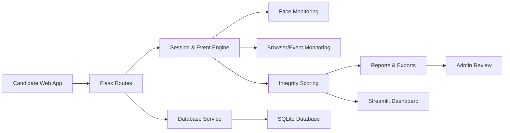
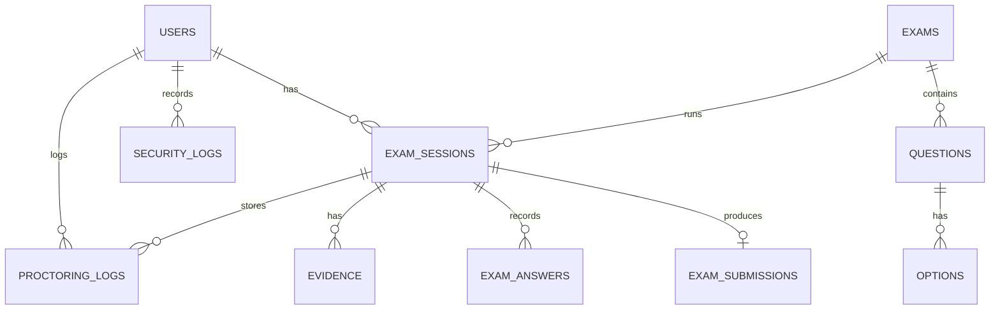
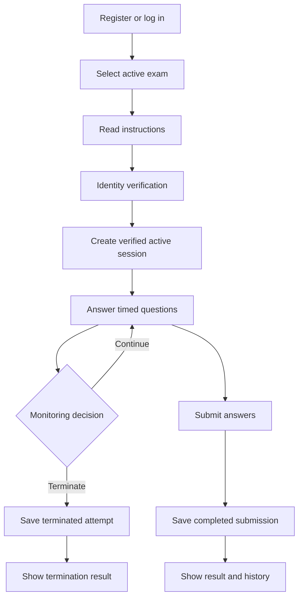
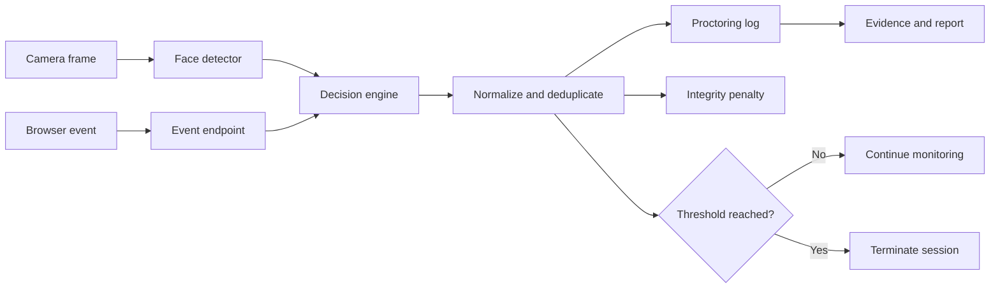
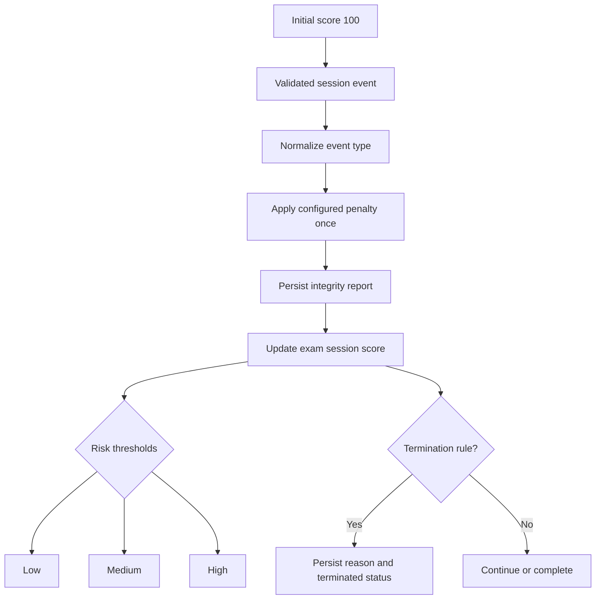
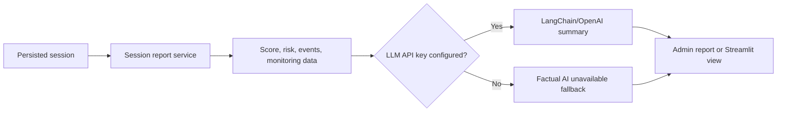
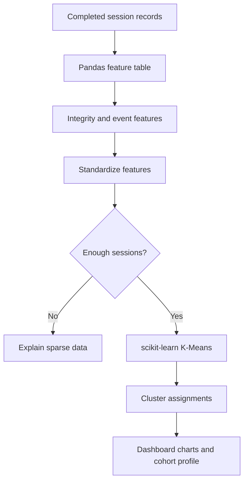

# Development of Smart Examination Monitoring platform with Integrity Analysis & Reporting System

## 1. Cover Page

ExamGuard is a Flask-based academic integrity platform designed to monitor online examinations, detect suspicious activities, and produce measurable integrity reports for instructors and administrators. The system combines candidate authentication, face-presence monitoring, browser activity analysis, analytics, and evidence-based review into one practical solution for secure testing.

## 2. Abstract

The project addresses the challenge of maintaining fairness and integrity in online examinations. Traditional assessment systems are often vulnerable to cheating because they rely primarily on answer submissions without continuous behavioral monitoring. ExamGuard introduces a Smart Examination Monitoring Platform that records candidate session activity, checks face presence, observes browser events, and assigns integrity scores using rule-based and data-driven logic. The system provides candidate-facing workflows, administrator analytics, and exportable reports. The result is a more transparent, accountable, and operationally practical examination monitoring system.

## 3. Introduction

Examinations increasingly take place in remote or blended environments. While online frameworks offer convenience, they also present higher opportunities for misuse, including tab switching, camera absence, unauthorized help, and repeated suspicious events. A robust exam monitoring system must combine technical monitoring with fair evaluation and clear reporting. ExamGuard was developed to meet that need by combining computer vision, browser monitoring, session management, scoring, evidence records, and analytics in a unified solution.

## 4. Problem Statement

In digital examinations, invigilators often cannot observe every candidate continuously, especially in large cohorts. Without transparent monitoring, students may circumvent exam rules by leaving the browser, looking away from the camera, or using unauthorized devices. Existing systems frequently provide only score reporting without real-time behavioral evidence, making academic integrity analysis weak and difficult to justify.

## 5. Objectives

- Build a secure candidate and admin workflow for examination management.
- Monitor candidate presence and behavior during examinations.
- Track browser activity and suspicious events in real time.
- Compute integrity scores and risk labels consistently.
- Produce reports and exports for review and audit trails.
- Support practical analytics with clustering and cohort profiling.
- Maintain a clear and maintainable application architecture.

## 6. Scope

The platform covers candidate registration, exam assignment, question delivery, monitored session checks, event detection, score computation, result generation, and admin analytics. The system is implemented using Flask for the web interface and SQLite for persistent storage. OpenCV face detection provides the core camera monitoring capability, and browser monitoring is implemented via server-side event ingestion. Data science features use pandas, matplotlib, seaborn, and scikit-learn for reporting and clustering.

## 7. Existing System

Many standard examination systems record submitted answers but do not monitor candidate behavior consistently. They often fail to capture the full session context, lack risk classification, and do not provide evidence-driven reports. This leaves a significant gap between completion and trustworthy assessment integrity.

## 8. Proposed System

ExamGuard proposes a monitoring-first architecture where every candidate activity is part of the exam record. The system records login, exam start, question progress, camera presence, and suspicious browser operations. A decision engine computes penalties and integrity scores using actual session events. Reports present a factual summary of behavior and risk, using transparent scoring rather than opaque heuristics.

## 9. System Architecture

The architecture separates candidate interaction from monitoring logic. Browser and face observation are recorded as events, then evaluated by the decision engine and stored as scoring evidence. The database remains the single system of record, while the admin dashboard and exports read from the same persisted data.

## 10. Detailed Workflow

1. A candidate creates an account and uploads a profile photo.
2. The user logs in and selects an active exam.
3. The system verifies candidate identity before the exam starts.
4. A monitoring session is created with a unique token and active state.
5. The exam begins with a timed question attempt and browser monitoring active.
6. Face presence is checked continuously using Haar cascade detection.
7. Browser events such as tab switches, focus loss, and fullscreen exits are logged.
8. The decision engine evaluates events and applies penalties when thresholds are reached.
9. A session integrity score is recalculated and stored in the same database record.
10. The candidate may complete the exam or be terminated if serious integrity violations occur.
11. Reports, exports, and dashboard views summarize the session evidence.

## 11. Functional Modules

### Candidate Module
This module handles registration, login, profile access, exam selection, instructions, identity verification, and result history.

### Exam Module
This module manages assignment timers, question loading, answer recording, session state, and completion or termination flow.

### Proctoring Module
This module receives browser and camera events, normalizes them into standardized event types, and passes them to the decision-engine scoring pipeline.

### Admin Module
This module exposes authorized analytics, evidence review, and export endpoints for invigilators.

### Reporting and Analytics Module
This module converts raw session activity into human-readable reports, risk labels, charts, and AI-generated summaries when available.

## 12. Face Monitoring

Face monitoring is implemented using OpenCV Haar Cascade classification to determine whether the candidate remains in view. The project focuses specifically on face presence detection, not biometric recognition. Active monitoring time and face-present time are tracked so the system can compute a face presence ratio. This ratio is a core integrity metric and supports transparent reasoning about camera absence.

## 13. Browser Monitoring

The browser monitoring workflow records tab switching, focus loss, fullscreen exits, copy, paste, and other suspicious signals. These events are generated by the front-end and validated by the back-end against the active session. The server treats event collection as authoritative and stores event metadata, timestamps, and severity information to support audit review.

## 14. Suspicious Event Detection

The platform classifies events into standardized categories such as FACE_ABSENT, MULTIPLE_FACE, PHONE_DETECTED, and browser violations. Each event is stored in the proctoring log with a timestamp and severity. The decision engine applies score penalties according to the event type and configured thresholds. Duplicate or repeated events are filtered to prevent false inflation.

## 15. Integrity Scoring

The integrity engine starts from a score of 100 and applies deductions for suspicious events and face-presence violations. The final score is stored in the exam_sessions record and is used for risk classification. Low, Medium, and High risk labels are derived consistently from the score, ensuring that the same thresholding rules are used throughout the platform.

## 16. Face Presence Ratio

The face presence ratio is defined as:

$presence\_ratio = \frac{face\_present\_time}{active\_monitoring\_time}$

This metric uses actual timestamps from monitoring events and excludes periods outside active exam monitoring. The platform keeps only verified session intervals and stores duration-based data so the ratio can be reported honestly and consistently.

## 17. AI/LangChain Reporting

When an API key is configured, the system can produce a narrative integrity summary based on session events and score information. If no AI provider is configured, the project uses a factual local fallback message rather than inventing results. This protects the reliability of the final report and ensures the application remains usable in offline or restricted environments.

## 18. Data Science Analytics

The analytics layer uses pandas for session aggregation, matplotlib and seaborn for charting, and scikit-learn for risk analysis and K-Means clustering. The platform computes score distributions, event frequencies, cohort risk profiles, and cluster assignments when enough data is available. The K-Means component is a real scikit-learn implementation, not a simple score bucket threshold.

## 19. K-Means Clustering

K-Means clustering is used to analyze behavioral patterns across exam sessions. Features such as integrity score, tab switches, focus losses, and suspicious events are standardized before clustering. When the dataset is too sparse, the platform returns a clear explanatory message instead of fabricating cluster results.

## 20. Database Design

The application uses SQLite with tables for users, exams, questions, options, exam sessions, submissions, logs, active sessions, evidence, and analytics-related records. The database layer contains migration-safe schema creation and automatic repair logic to support evolving project requirements without forcing destructive data loss.

## 21. ER Diagram

## 21A. Candidate Exam Workflow

## 21B. Proctoring and Event Flow

## 21C. Integrity Scoring Flow

## 21D. AI Report Flow

## 21E. Data Science and K-Means Flow

## 22. Security and Privacy

The platform protects session integrity by validating ownership of active sessions and checking authorization before exposing private results. Candidate photos and evidence files are stored under controlled directories, and the application avoids insecure default credentials. Secret values are expected to be supplied through environment variables instead of hardcoded operational values.

## 23. Streamlit Dashboard

The Streamlit application provides an invigilator-facing dashboard for monitoring sessions, reviewing integrity scores, visualizing event patterns, and exploring cohort risk data. It remains optional and reads the same underlying database as the Flask application.

## 24. Alert and Evidence Management

Suspicious events are persisted with timestamps and details. Evidence records include the relevant session and event metadata, and if a supporting screenshot or file exists, it is stored in the evidence directory. This allows administrators to review misconduct patterns in context.

## 25. JSON/CSV Exports

Administrators can export session data in JSON or CSV format for downstream analysis. The exports include session metadata, scores, risk status, event details, and report-related information when available.

## 26. Testing

The project includes regression tests for face absence handling, browser events, and exam question seeding. The testing process validates compilation, database initialization, route behavior, session integrity logic, and export or analytics sanity checks. Additional manual verification is recommended for webcam permissions and browser events in a live environment.

### Verification boundaries

Verified in the current environment: dependency checks, automated unit/regression tests, Python compilation, Flask smoke startup, Haar cascade loading, YOLO model loading, and Streamlit module import.

Not verified in the current environment: a complete live browser examination workflow, a real webcam face-return cycle, a live LLM provider call without a configured API key, screenshot capture during a live session, and a full clean-install test in a newly created environment.

## 27. Limitations

- Real webcam monitoring depends on the host environment and camera availability.
- Face detection is based on Haar cascades and is best suited to practical detection rather than identity matching.
- AI reporting remains optional and depends on environment configuration.
- Some suspicious behaviors require client-side browser permission and live user interaction.

## 28. Future Enhancements

- Add more robust identity verification and anti-spoofing checks.
- Expand browser activity monitoring with richer event categorization.
- Support additional model-based detection for more advanced misconduct analysis.
- Introduce stronger role-based administration and audit workflows.
- Add a more extensive analytics and dashboard customization layer.

## 29. Conclusion

ExamGuard demonstrates how a practical academic integrity monitoring system can combine exam workflow management with continuous behavioral monitoring, scoring, and reporting. The design supports both candidate usability and administrative oversight while maintaining clear evidence trails and measurable risk classifications.

## 30. References

- Flask Documentation
- OpenCV Haar Cascade Documentation
- scikit-learn K-Means Documentation
- SQLite Database Documentation
- Streamlit Documentation
- LangChain/OpenAI Documentation
