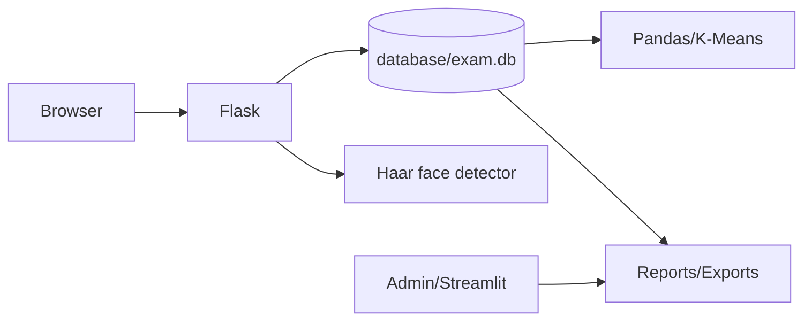

# Architecture

Flask is the candidate-facing application. Blueprints separate authentication, dashboard, exam lifecycle, proctoring, and authorized admin APIs. `DatabaseService` owns SQLite connections and migrations. Services provide face detection, integrity decisions, reporting, Pandas scoring, K-Means clustering, and exports.

The browser submits answers and browser events to Flask. The server validates candidate ownership and active session state. Exam timing is stored in `exam_sessions`; client JavaScript is only a display and recovery layer.

